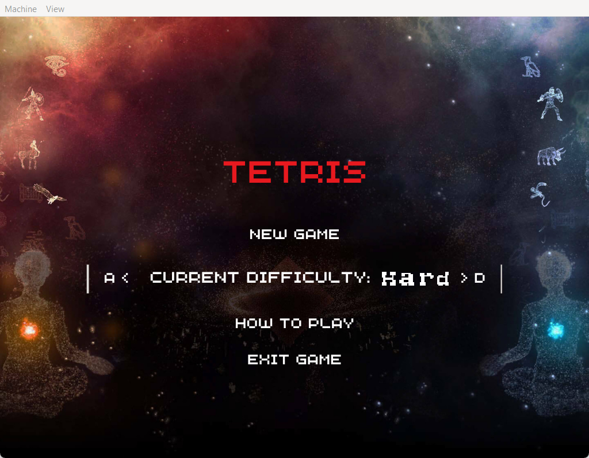
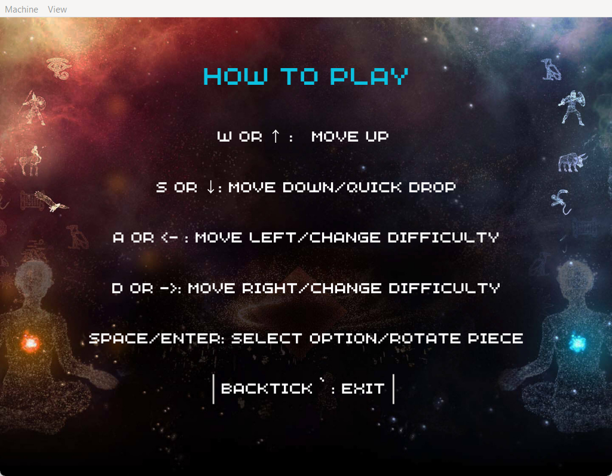
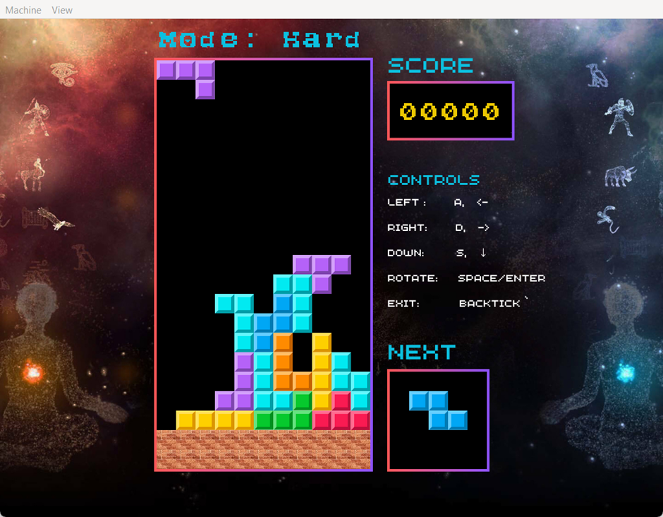
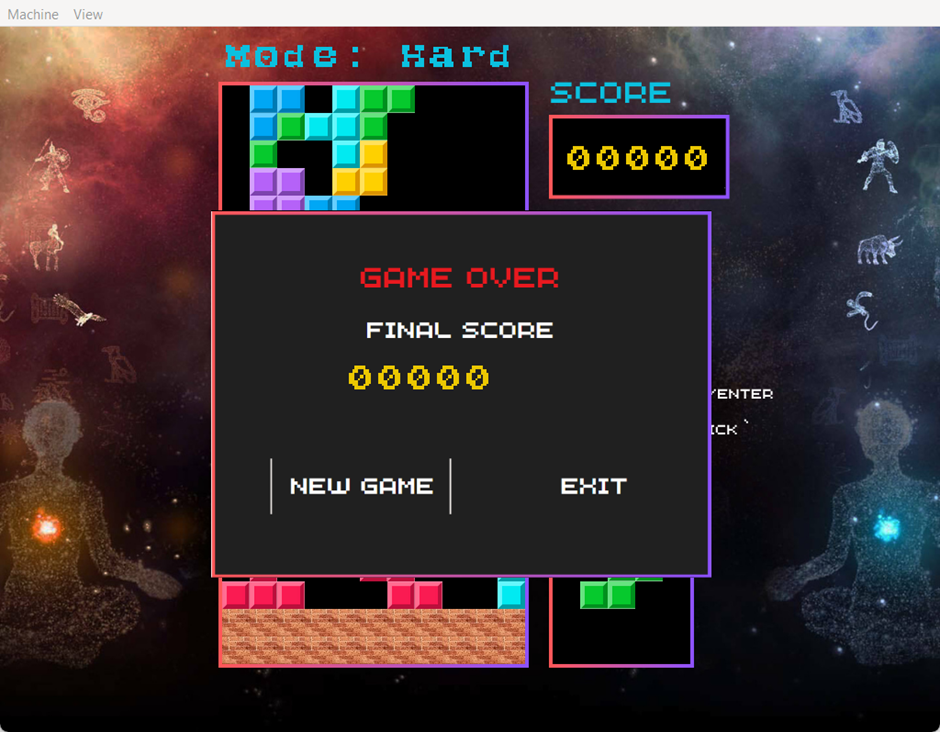

# Getting Started

This project by default compiles for Raspberry Pi 4 with UART1.

Alternatively, these are different commands for Raspberry Pi 3 and UART0:

```sh
make r3_u0
make r3_u1
make r4_u0
make r4_u1
```

For NixOS or system that uses Nixpkgs, cross-compile and develop by

```sh
nix develop
```

For others, install the according aarch64 toolchain

### Project Overview

This project implements a version of the classic Tetris game on a bare-metal operating system (OS) running on a Raspberry Pi. It is part of the EEET2490 Embedded Systems: OS and Interfacing course. The project focuses on various embedded systems concepts, including low-level hardware interfacing, timer handling, UART communication, and graphical rendering without relying on external libraries.

The development of this game demonstrates a range of system-level programming skills, such as command-line interface (CLI) implementation, screen rendering (text, images, video), and game development in a constrained environment without standard operating system support.

### Features Implemented

1. **Command Line Interface (CLI)** :

* The CLI supports various commands such as `help`, `clear`, `showinfo`, and configuration commands for `baudrate` and `stopbit`.
* Includes features like command history, auto-completion, and colored text using ANSI escape codes.

2. **Screen Display** :

* The system displays images, videos, and text using custom rendering functions.
* Video playback runs at 25 frames per second, utilizing non-blocking timers for smooth user interaction.

3. **Tetris Game** :

* Traditional Tetris gameplay with piece movement, rotation, and score tracking.
* Three difficulty levels (easy, medium, and hard), where higher levels introduce faster gameplay and frozen blocks.
* A scoring system that encourages clearing multiple rows at once.
* Visual game feedback, including a game-over screen and current score display.

4. **Non-blocking Timer** :

* Timers are utilized to handle in-game events, video frame rendering, and UART input without blocking the CPU.
* Ensures smooth gameplay and user interactions in the game and video player modes.

5. **UART Communication** :

* The project features UART communication to interact with the system via a terminal emulator.
* Baud rate and stop bit settings can be configured through CLI commands.

### Project Structure

```bash
/src
  ├── boot.S                   # Bootloader code
  ├── kernel.c                 # Main kernel code
  ├── game.c                   # Game logic and rendering
  ├── uart.c                   # UART communication functions
  ├── timer.c                  # Timer handling functions
  ├── tty.c                    # CLI-related utilities (ANSI codes, cursor control)
  ├── display.c                # Image, text, and video rendering
  ├── video_player.c           # Video playback implementation
  ├── game_screens.c           # Game screen rendering functions
  ├── commands.c               # Command registration and execution
  ├── fonts.c                  # Custom font glyph definitions
  └── Makefile                 # Build and linking instructions
```

### CLI Commands

* **baudrate**: Change board baud rate (available in: CLI mode)
* **clear**: Clear current shell (available in: CLI and Video modes)
* **currentmode**: Show the current program's mode (available in: CLI and Video modes)
* **displayimage**: Display an image with team member's names (available in: CLI mode
* **exit**: Exit the current program's mode (available in: Video modes)
* **help**: Show help message (available in: CLI and Video modes)
* help `<command>`: More information on a specific command
* **pause**: Stop video player (available in: Video mode)
* **playgame**: Switch to game play mode (available in: CLI and Video modes)
* **playvideo**: Switch to video play mode (available in: CLI mode)
* **resume**: Resume video player (available in: Video mode)
* **showinfo**: Show hardware information (available in: CLI and Video modes)
* **stopbit**: Change board stopbit (available in: CLI mode)

### Tetris Game Controls

* **W / Arrow Up** : Move up in menu (no action in gameplay).
* **S / Arrow Down** : Increase brick fall speed.
* **D / Arrow Right** : Move brick right.
* **A / Arrow Left** : Move brick left.
* **Space / Enter** : Rotate the current brick.
* **Backtick (`)** : Exit to the main menu or quit the game.

### Testing and Known Issues

The game and CLI have been thoroughly tested on both Raspberry Pi 3 and 4. As of the final release, no known bugs exist, and all features function as intended.

#### Limitations:

* The game currently does not include sound or animation, which may be considered for future improvements.

## Acknowledgments

We would like to thank our lecturer, Dr. Linh Tran, for guiding us through the concepts of bare-metal programming, and for providing invaluable feedback throughout the project. Additionally, we thank the Raspberry Pi Foundation for providing open resources to help with low-level hardware interaction.

## Team Members

* Ngo Ngoc Thinh - s3879364
* Do Khoa Nguyen - s397 8796
* Tran The Quang Minh - s3979562
* Nguyen Dinh Quoc Bao - s3938309
* Tran Kiem Phuc - s3927187

## Previews







## Project Demo

TBU
